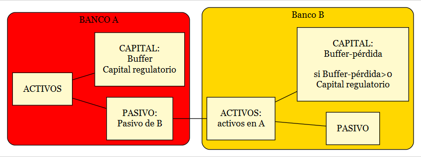
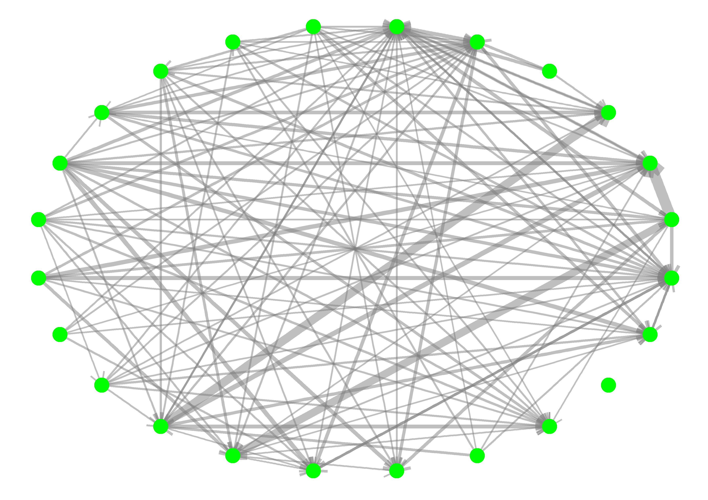
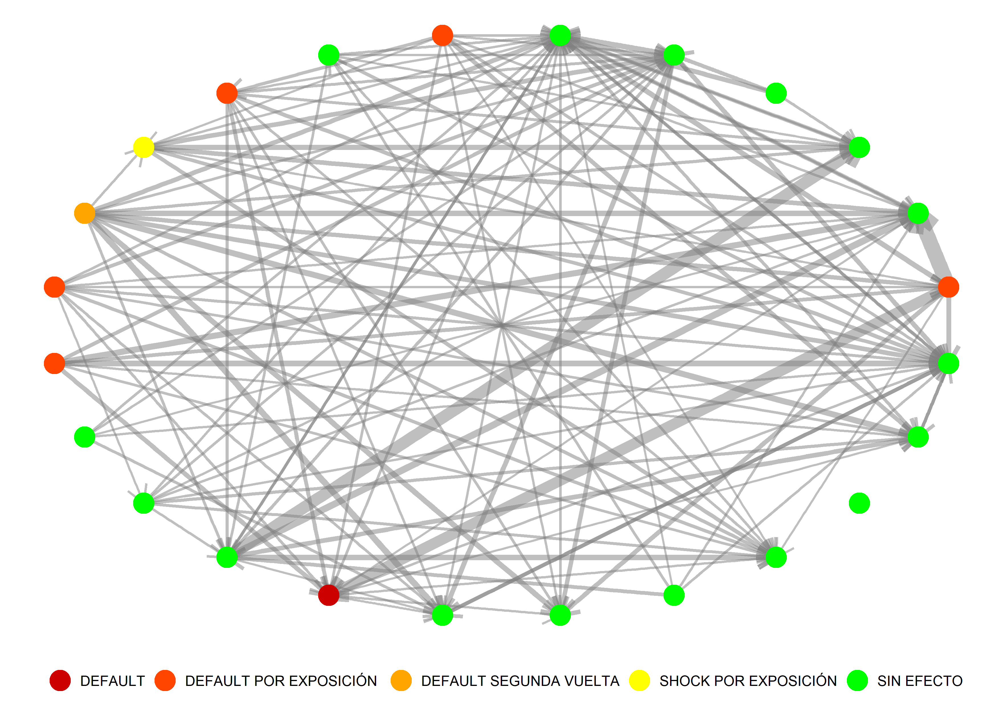
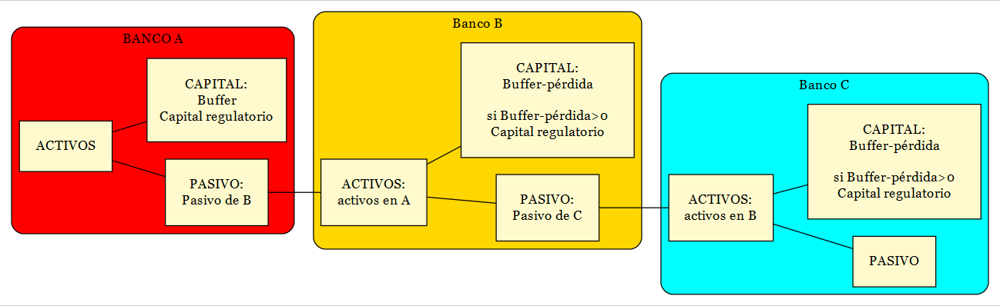

layout: true
background-image: url(Logo.jpg)
background-position: 95% 2.5%
background-size: 5.0%
font-family: Futura
---

**TABLA DE CONTENIDO**
1. [ANTECEDENTES](#id1)

2. [INTRODUCCIÓN ANÁLISIS DE REDES](#id2)

3. [MODELO DE CONTAGIO CASCADA](#id3)

4. [MODELO DE CONTAGIO DEBTRANK](#id4)

5. [COMPARATIVOS ENTRE MODELOS DESDE EL ENFOQUE DE SISTEMA](#id5)

6. [EXTENSIONES DEL MODELO DEBTRANK](#id6)

7. [PROPUESTA DE TRABAJO PARA EL IEFR-21](#id7)

---
name: id1
### ANTECEDENTES
$$ $$

- En respuesta a una solicitud del Consejo Monetario Centroamericano y del Consejo Centroamericano de Superintendentes de Bancos, de Seguros y de Otras Instituciones Financieras, un equipo del Departamento de Mercado Monetario y de Capitales del Fondo Monetario Internacional (MCM) visitaron la región durante el 11 al 21 de enero y el 2 al 12 de febrero de 2016.

- El objetivo de la misión incluyó un ejercicio de: "Integración financiera en Colombia, Centroamérica, Panamá y República Dominicana con análisis de redes" elaborado por: Ana Corbacho y colaboradores del Equipo del Departamento del Hemisferio Occidental del FMI.

---
### ANTECEDENTES
$$ $$

Entre los resultados del ejercicio "Integración financiera en Colombia, Centroamérica, Panamá y República Dominicana con análisis de redes" se destaca: 

```{r echo=FALSE, out.width = "750px", out.height="450px",fig.align='center'}
knitr::include_graphics("ANA.png")
```
---
### ANTECEDENTES
$$ $$

Y como conlusiones de mediano plazo se expresarón:

1. Establecer un "Consejo de Estabilidad Financiera Regional", capitalizando los foros existentes, con participación de Bancos Centrales, Supervisores Financieros y Ministerios de Finanzas.

2. Avanzar con el análisis de redes a nivel nacional considerando objetivos comunes regionales. **La Prioridad:** *Cerrar brechas a nivel nacional con objetivos regionales de mediano plazo.*

3. Establecer protocolos para identificar instituciones sistémicas a nivel regional. Para lo cual se requiere: Intercambio de datos financieros y un equipo técnico con la capacidad de repetir las simulaciones de contagio.

4. Apoyo de las autoridades a la capacitación especial de un equipo técnico:

- [Seminario: "Análisis de Redes Complejas Aplicadas a temas de Estabilidad Financiera", realizado en Tegucigalpa Honduras los días 27, 28 y 29 de mayo 2019]()


---
name: id2
### INTRODUCCIÓN ANÁLISIS DE REDES

$$ $$

Una red muestra las interconexiones entre individuos (personas, bancos etc.). La presencia o ausencia de interconexión indica si existe o no alguna forma de relación entre cada par de individuos. Se pueden ilustrar muchos patrones diferentes de relaciones a partir de un gráfico de redes.


```{r echo=FALSE, out.width = "800px", out.height="400px",fig.align='center'}
magick::image_read_pdf("IGRAPH_DEP.pdf")
```
---
### INTRODUCCIÓN ANÁLISIS DE REDES

$$ $$
Para la elaboración del análisis de redes, en particular para las exposiciones interbancarias de crédito, depósitos, inversiones etc. Se requiere una .red[**matriz de exposición**]:
```{r include=FALSE, cache=FALSE, results = 'hide', message = FALSE}
library(kableExtra)
library(latex2exp)
ORIGEN<-c("DESTINO", "DESTINO", "DESTINO", "DESTINO", "DESTINO", " ")
BANCOS<-c("B1", "B2", "B3", "...", "BN", "Filas")
B1<-c("0", "a12", "a13", "...", "a1N", "a1")
B<-c("...", "...", "...", "...","...","...")
BN<-c("aN1", "aN2", "aN3", "...", "0","aN")
Columnas<-c("c1", "c2", "c3", "...", "cN", "SUMA c=SUMA a")
df<-rbind(ORIGEN, BANCOS,B1,B,BN, Columnas)
df<-as.data.frame(df)
```

```{r echo=FALSE, warning=FALSE, results='asis'}
df %>%
   kbl(caption = "Matriz de exposición") %>%
   kable_styling(bootstrap_options = "striped", full_width = F, position = "center",  font_size = 20)%>%
   kable_classic(full_width = F, html_font = "Cambria")%>%
  column_spec(1, bold = F, border_right = T, border_left = T) %>%
  column_spec(2, bold = F, border_right = T)%>%
  column_spec(3, bold = F, border_right = T)%>%
  column_spec(4, bold = F, border_right = T)%>%
  column_spec(5, bold = F, border_right = T)%>%
  column_spec(6, bold = F, border_right = T)%>%
  column_spec(7, bold = F, border_right = T)%>%
  row_spec(0, bold = F, color = "#E7B70D", background = "#E7B70D")%>%
  row_spec(1, bold = T, color = "#084E9B", background = "#E7B70D")%>%
  row_spec(2, bold = T, color = "#084E9B", background = "#E7B70D")
```
---

```{r include=FALSE, cache=FALSE, results = 'hide', message = FALSE}
library("tidyr")
library("plyr")
library("dplyr")
library("xts")
library("zoo")
library("splitstackshape")
BASE          <- read.table("FROM_TO_DEP_2019.csv",  header = T, sep = ";")
BASE$ORIGEN   <- substr(BASE$ORIGEN, 0, 4)
BASE$ORIGEN   <- as.character(BASE$ORIGEN)
BASE$DESTINO  <- substr(BASE$DESTINO, 0, 4)
BASE$DESTINO  <- as.character(BASE$DESTINO)
SUBBASE       <- BASE
SUBBASE$id    <- paste(SUBBASE$ORIGEN, SUBBASE$DESTINO, sep="_")
SUBBASE$VALOR <- as.numeric(SUBBASE$VALOR)
AGREGA        <- aggregate(SUBBASE['VALOR'], by=SUBBASE['id'], sum)
AGREGA$id     <- as.character(AGREGA$id)
SUBBASE       <- concat.split(AGREGA, 1, sep = "_", drop = TRUE)
SUBBASE       <- data.frame(coredata(SUBBASE))
SUBBASE$id_1  <- as.character(SUBBASE$id_1)
SUBBASE$id_2  <- as.character(SUBBASE$id_2)
LINK          <- SUBBASE[,c(2,3,1)]
colnames(LINK)<- c("from", "to", "weight")
library(igraph)
library(ggplot2)
library(ggnetwork)
library(geomnet)
library(ggraph)
net  <- graph_from_data_frame(LINK, directed = TRUE)
E(net)$width  <-LINK[,3]/1000000
E(net)$weight <-LINK[,3]/1000000 

#######################------#############################
############################################################
##############################-##########################
###########SACANDO BNP #######################
net1 <- induced_subgraph(graph=net, vids=which(V(net)$name!="A001"))
# Degrees
deg     <- degree(net, mode = "all")
deg.in  <- degree(net, mode = "in")
deg.out <- degree(net, mode = "out")
# Degrees NET1
deg1     <- degree(net1, mode = "all")
deg.in1  <- degree(net1, mode = "in")
deg.out1 <- degree(net1, mode = "out")
# Strenght (weight sum)
str     <- strength(net, mode = "all")
str.in  <- strength(net, mode = "in")
str.out <- strength(net, mode = "out")
# Strenght (weight sum) NET1
str1     <- strength(net1, mode = "all")
str.in1  <- strength(net1, mode = "in")
str.out1 <- strength(net1, mode = "out")
#########ESTADÍSTICAS NET##########
P  <- gorder(net)
D  <- round(edge_density(net, loops=F),2)
MGD<- round(mean_distance(net, directed=T),2)
CUW<- round(transitivity(net, type="global"),2)
CWW<- transitivity(net,type="weighted", weights = E(net)$weight)
CWW<- round(mean(na.omit(CWW)),2)
#########ESTADÍSTICAS NET1##########
P1  <- gorder(net1)
D1  <- round(edge_density(net1, loops=F),2)
MGD1<- round(mean_distance(net1, directed=T),2)
CUW1<- round(transitivity(net1, type="global"),2)
CWW1<- transitivity(net1,type="weighted", weights = E(net1)$weight)
CWW1<- round(mean(na.omit(CWW1)),2)
#--------IN---------#-#####################
DI  <-  round(mean(degree(net, mode="in")),2)
DIS <-  round(sd(degree(net, mode="in")),2)
DISK<-  round(psych::describe(degree(net, mode="in"))[[11]],2)
DIKU<-  round(psych::describe(degree(net, mode="in"))[[12]],2)
POWI<-  power.law.fit(degree(net, mode="in"), NA)
ALPI<-  round(POWI$alpha,2)
V(net)$IN<-deg.in
ASSI<-  round(assortativity(net, V(net)$IN, directed = TRUE),2)
#--------IN--NET1-------#-#####################
DI1  <-  round(mean(degree(net1, mode="in")),2)
DIS1 <-  round(sd(degree(net1, mode="in")),2)
DISK1<-  round(psych::describe(degree(net1, mode="in"))[[11]],2)
DIKU1<-  round(psych::describe(degree(net1, mode="in"))[[12]],2)
POWI1<-  power.law.fit(degree(net1, mode="in"), NA)
ALPI1<-  round(POWI1$alpha,2)
V(net1)$IN<-deg.in1
ASSI1<-  round(assortativity(net1, V(net1)$IN, directed = TRUE),2)
#--------OUT   ---------#-#####################
DO <-   round(mean(degree(net, mode="out")),2)
DOS<-   round(sd(degree(net, mode="out")),2)
DOSK<-  round(psych::describe(degree(net, mode="out"))[[11]],2)
DOKU<-  round(psych::describe(degree(net, mode="out"))[[12]],2)
POWO<-  power.law.fit(degree(net, mode="out"), NA)
ALPO<-  round(POWO$alpha,2)
V(net)$OUT<-deg.out
ASSO<-  round(assortativity(net, V(net)$OUT, directed = TRUE),2)
#--------OUT  NET ---------#-#####################
DO1 <-   round(mean(degree(net1, mode="out")),2)
DOS1<-   round(sd(degree(net1, mode="out")),2)
DOSK1<-  round(psych::describe(degree(net1, mode="out"))[[11]],2)
DOKU1<-  round(psych::describe(degree(net1, mode="out"))[[12]],2)
POWO1<-  power.law.fit(degree(net1, mode="out"), NA)
ALPO1<-  round(POWO1$alpha,2)
V(net1)$OUT<-deg.out1
ASSO1<-  round(assortativity(net1, V(net1)$OUT, directed = TRUE),2)
#_______STREGHT IN_______________############################
SI <-   round(mean(strength(net, mode="in")),2)
SIS<-   round(sd(strength(net, mode="in")),2)
SISK<-  round(psych::describe(strength(net, mode="in"))[[11]],2)
SIKU<-  round(psych::describe(strength(net, mode="in"))[[12]],2)
POWSI<- power.law.fit(strength(net, mode="in"), NA)
ALPSI<- round(POWSI$alpha,2)
V(net)$SIN<-str.in
ASSPI<- round(assortativity(net, V(net)$SIN, directed = TRUE),2)
#_______STREGHT IN NET1_____________############################
SI1 <-   round(mean(strength(net1, mode="in")),2)
SIS1<-   round(sd(strength(net1, mode="in")),2)
SISK1<-  round(psych::describe(strength(net1, mode="in"))[[11]],2)
SIKU1<-  round(psych::describe(strength(net1, mode="in"))[[12]],2)
POWSI1<- power.law.fit(strength(net1, mode="in"), NA)
ALPSI1<- round(POWSI1$alpha,2)
V(net1)$SIN<-str.in1
ASSPI1<- round(assortativity(net1, V(net1)$SIN, directed = TRUE),2)
#_______STREGHT OUT_______________############################
SO <-   round(mean(strength(net, mode="out")),2)
SOS<-   round(sd(strength(net, mode="out")),2)
SOSK<-  round(psych::describe(strength(net, mode="out"))[[11]],2)
SOKU<-  round(psych::describe(strength(net, mode="out"))[[12]],2)
POWSO<-  power.law.fit(strength(net, mode="out"), NA)
ALPSO<-  round(POWSO$alpha,2)
V(net)$SOUT<-str.out
ASSPO<-  round(assortativity(net, V(net)$SOUT, directed = TRUE),2)
#_______STREGHT OUT_NET1______________############################
SO1 <-   round(mean(strength(net1, mode="out")),2)
SOS1<-   round(sd(strength(net1, mode="out")),2)
SOSK1<-  round(psych::describe(strength(net1, mode="out"))[[11]],2)
SOKU1<-  round(psych::describe(strength(net1, mode="out"))[[12]],2)
POWSO1<-  power.law.fit(strength(net1, mode="out"), NA)
ALPSO1<-  round(POWSO1$alpha,2)
V(net1)$SOUT<-str.out1
ASSPO1<-  round(assortativity(net1, V(net1)$SOUT, directed = TRUE),2)
######################TABLA DE RESUMEN################
C0<-c("Participantes", "Densidad", "Distancia geodésica media", "Conglemerado",
      "Conglemerado ponderado", "Media", "Desviación estándar", "Sesgo",
      "Kurtosis", "Exponente ley de poder", "Índice de asociatividad", 
      "Media", "Desviación estándar", "Sesgo",
      "Kurtosis", "Exponente ley de poder", "Índice de asociatividad")
C1<-c(P, D, MGD, CUW, CWW, rep("---",12))
C2<-c(rep("---",5), DI, DIS, DISK, DIKU, ALPI, ASSI,
      SI, SIS, SISK, SIKU, ALPSI, ASSPI)
C3<-c(rep("---",5),DO, DOS, DOSK, DOKU, ALPO, ASSO, 
      SO, SOS, SOSK, SOKU, ALPSO, ASSPO)
C4<-c(P1, D1, MGD1, CUW1, CWW1, rep("---",12))
C5<-c(rep("---",5), DI1, DIS1, DISK1, DIKU1, ALPI1, ASSI1,
      SI1, SIS1, SISK1, SIKU1, ALPSI1, ASSPI1)
C6<-c(rep("---",5),DO1, DOS1, DOSK1, DOKU1, ALPO1, ASSO1, 
      SO1, SOS1, SOSK1, SOKU1, ALPSO1, ASSPO1)
df<-cbind(C0,C1,C2,C3,C4,C5,C6)
df<-as.data.frame(df)
colnames(df)<-c(" ","Generales", "Origen", "Destino"," Generales", " Origen", " Destino")
library(kableExtra)


```

```{r echo=FALSE, warning=FALSE, results='asis'}
kbl(df,  caption = "Estadísticas estádar 
    para la red de colocaciones en depósitos interbancarios de Panmá a diciembre 2019.") %>%
kable_classic(full_width = F, position = "center",  font_size = 14,
                html_font = "Futura Lt")%>%
pack_rows("GRADO", 6, 11) %>%
pack_rows("FUERZA", 12, 17)%>%
add_header_above(c("Conceptos"=1,"Con el Banco \n Nacional" = 3,
                   "Sin el Banco \n Nacional" = 3)
)
```


---
name: id3
### MODELO DE CONTAGIO CASCADA

```{r include=FALSE, cache=FALSE, results = 'hide', message = FALSE}
library(DiagrammeR) 
library(DiagrammeRsvg) 
library(rsvg) 

G <-grViz("digraph{

      graph[rankdir = LR]
  
      
      node[shape = rectangle, style = filled]
  
      subgraph cluster_0 {
        graph[shape = rectangle]
        style = rounded
        bgcolor = red
    
        label = 'BANCO A'
        node[shape = rectangle, fillcolor = LemonChiffon, margin = 0.25]
        F[label  = 'ACTIVOS']
        FF[label = 'PASIVO: \n Pasivo de B']
        G[label  = 'CAPITAL: \n Buffer \n Capital regulatorio']
       
      }
  
      subgraph cluster_1 {
         graph[shape = rectangle]
         style = rounded
         bgcolor = Gold
    
         label = 'Banco B'
         node[shape = rectangle, fillcolor = LemonChiffon, margin = 0.25]
         F1[label = 'ACTIVOS: \n activos en A']
        FF1[label =  'PASIVO']
        G1[label =   'CAPITAL: \n Buffer-pérdida \n
        si Buffer-pérdida>0 \n Capital regulatorio']
      }
  
      edge[color = black, arrowhead = none, arrowsize = 1.25]
      F  -> {FF G}
      F1 -> {FF1 G1 }
      FF -> {F1}
      }")
# export graph
export_svg(G) %>%
  charToRaw() %>%
  rsvg() %>%
  png::writePNG("G3.png")
```
```{r echo=FALSE, out.width = "750px", out.height="450px",fig.align='center'}

```


---
### MODELO DE CONTAGIO CASCADA

 ```{css echo=FALSE}
.pull-left {
  float: left;
  width: 44%;
}
.pull-right {
  float: right;
  width: 44%;
}
.pull-right ~ p {
  clear: both;
}
```
    
.pull-left[
```{r echo=FALSE, out.width = "400px", out.height="400px",fig.align='center'}

```
]
.pull-right[
```{r echo=FALSE, out.width = "400px", out.height="400px",fig.align='center'}

```
]

---
### MODELO DE CONTAGIO CASCADA

```{r echo=FALSE, out.width = "800px", out.height="550px",fig.align='center'}
magick::image_read_pdf("CASCADA.pdf")
```

---
name: id4
### MODELO DE CONTAGIO DEBTRANK


```{r include=FALSE, cache=FALSE, results = 'hide', message = FALSE}
library(DiagrammeR) 
library(DiagrammeRsvg) 
library(rsvg) 

G <-grViz("digraph{

      graph[rankdir = LR]
  
      
      node[shape = rectangle, style = filled]
  
      subgraph cluster_0 {
        graph[shape = rectangle]
        style = rounded
        bgcolor = red
    
        label = 'BANCO A'
        node[shape = rectangle, fillcolor = LemonChiffon, margin = 0.25]
        F[label  = 'ACTIVOS']
        FF[label = 'PASIVO: \n Pasivo de B']
        G[label  = 'CAPITAL: \n Buffer \n Capital regulatorio']
       
      }
  
      subgraph cluster_1 {
         graph[shape = rectangle]
         style = rounded
         bgcolor = Gold
    
         label = 'Banco B'
         node[shape = rectangle, fillcolor = LemonChiffon, margin = 0.25]
         F1[label = 'ACTIVOS: \n activos en A']
        FF1[label =  'PASIVO: \n Pasivo de C']
        G1[label =   'CAPITAL: \n Buffer-pérdida \n
        si Buffer-pérdida>0 \n Capital regulatorio']
      }
  
  subgraph cluster_2 {
         graph[shape = rectangle]
         style = rounded
         bgcolor = cyan
    
         label = 'Banco C'
         node[shape = rectangle, fillcolor = LemonChiffon, margin = 0.25]
         C1[label = 'ACTIVOS: \n activos en B']
        C2[label =  'PASIVO']
        C3[label =   'CAPITAL: \n Buffer-pérdida \n
        si Buffer-pérdida>0 \n Capital regulatorio']
      }
      edge[color = black, arrowhead = none, arrowsize = 1.25]
      F  -> {FF G}
      F1 -> {FF1 G1 }
      C1 -> {C2 C3}
      FF -> {F1}
      FF1-> {C1}
      }")
# export graph
export_svg(G) %>%
  charToRaw() %>%
  rsvg() %>%
  png::writePNG("G4.png")
```
```{r echo=FALSE, out.width = "750px", out.height="450px",fig.align='center'}

```


---
### MODELO DE CONTAGIO DEBTRANK

```{r echo=FALSE, out.width = "800px", out.height="550px",fig.align='center'}
magick::image_read_pdf("DEBTRANK.pdf")
```


---
name: id5
### COMPARATIVOS ENTRE MODELOS DESDE EL ENFOQUE DE SISTEMA
$$ $$
Modelo de contagio
   
.pull-left[
```{r echo=FALSE, out.width = "400px", out.height="400px",fig.align='center'}
magick::image_read_pdf("IAC_CASCADA_1.pdf")
```
]
.pull-right[
```{r echo=FALSE, out.width = "400px", out.height="400px",fig.align='center'}
magick::image_read_pdf("IAC_CASCADA_2.pdf")
```
]

---
### COMPARATIVOS ENTRE MODELOS DESDE EL ENFOQUE DE SISTEMA
$$ $$
Modelo de debtrank
   
.pull-left[
```{r echo=FALSE, out.width = "400px", out.height="400px",fig.align='center'}
magick::image_read_pdf("IAC_DEBTRANK_1.pdf")

```
]
.pull-right[
```{r echo=FALSE, out.width = "400px", out.height="400px",fig.align='center'}
magick::image_read_pdf("IAC_DEBTRANK_2.pdf")

```
]


---
name: id6
### EXTENSIONES DEL MODELO DEBTRANK

```{r echo=FALSE, out.width = "800px", out.height="550px",fig.align='center'}
magick::image_read_pdf("DEBTRANK_SHOCKS.pdf")
```
---
name: id7
### PROPUESTA DE TRABAJO PARA EL IEFR-21

1. REALIZAR UN EJERCICIO DEL MODELO DE CASCADA PARA CADA PAÍS (ECONOMÍA CERRADA) PARA SU INCORPORACIÓN EN EL IEFR-21
  + CONSIDERANDO **UNICAMENTE** COMO CANAL DE EXPOSICIÓN LOS DEPÓSITOS.

2. COMO RECUADRO INCLUIR UN EJERCICIO DEL MODELO CASCADA DESDE COLOMBIA HACIA PANAMÁ.

3. EXPLORAR POR PAÍS LA CAPACIDAD PARA COMPILAR EXPOSICIONES TRANSFRONTERIZAS. CONOCER SUS LIMITACIONES EN CUANTO INFORMACIÓN Y EXPONERLAS EN EL IEFR-21.

---
class: center, middle  

MUCHAS GRACIAS

Luis Ortiz Cevallos
email: lortiz@secmca.org

